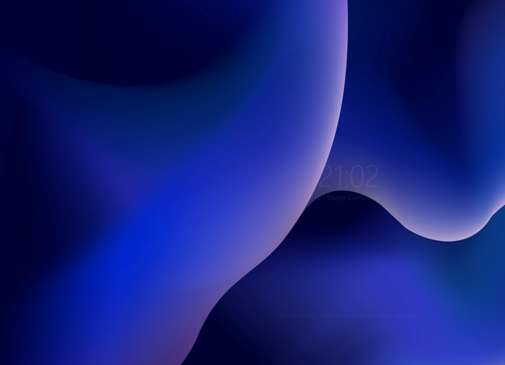
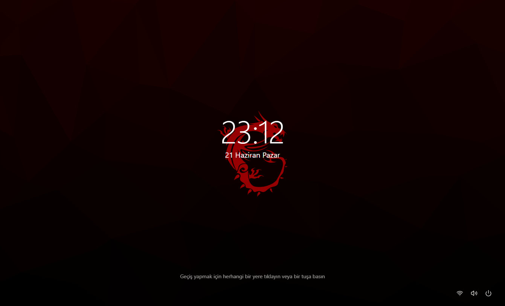
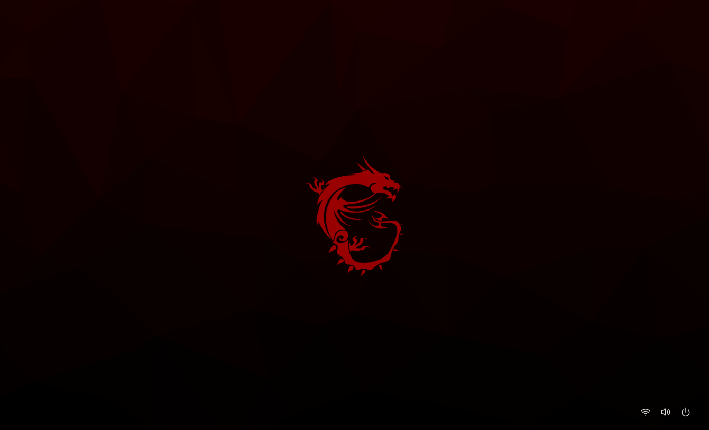
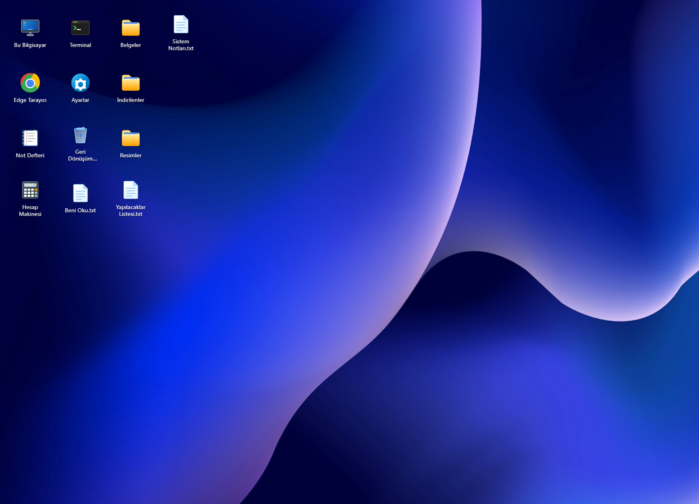
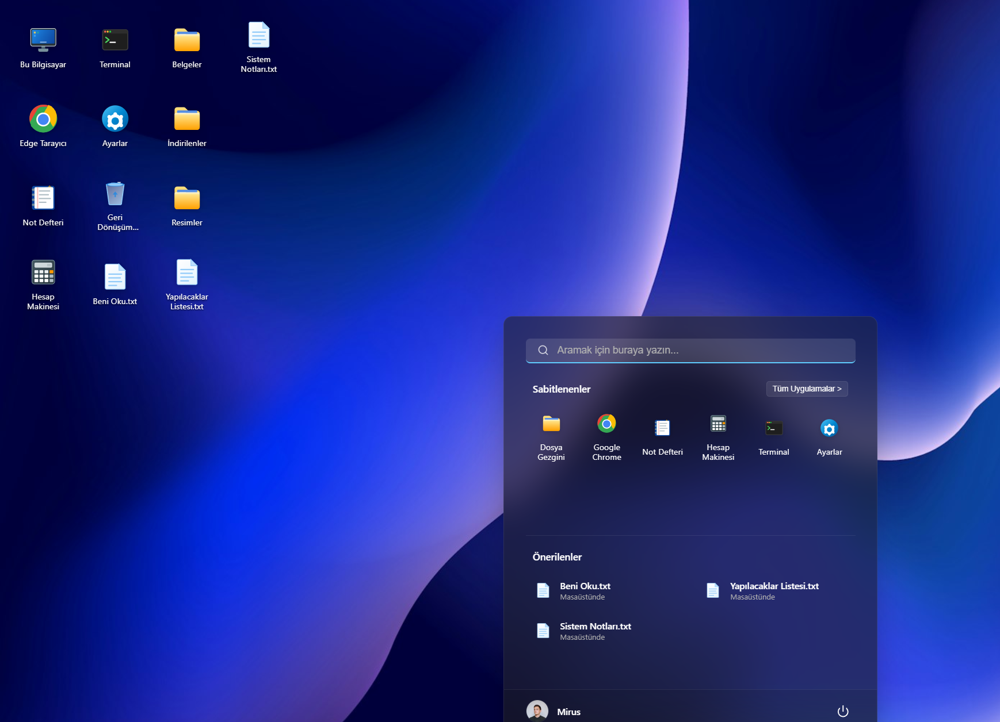
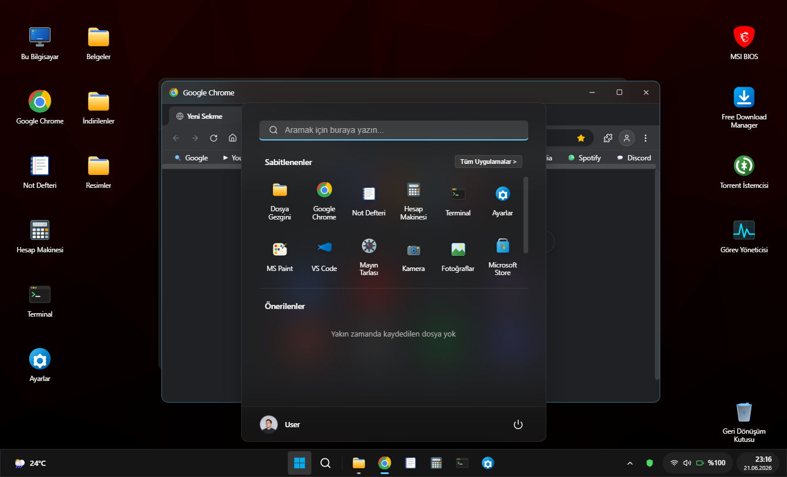

# react-os-win

Tarayıcıda çalışan, **Windows 11 masaüstünü** uçtan uca simüle eden tam ekran web uygulaması. MSI BIOS POST ekranından başlayarak kilit ekranı, masaüstü, pencere yönetimi, görev çubuğu ve onlarca yerleşik uygulama sunar.

[](https://react.dev/)
[](https://www.typescriptlang.org/)
[](https://vitejs.dev/)

---

## Ekran Görüntüleri

### Açılış ve Giriş

| MSI BIOS POST | Kilit ekranı |
|:---:|:---:|
|  |  |

| Oturum açma paneli |
|:---:|
|  |

### Masaüstü ve Start Menü

| Masaüstü | Start menü |
|:---:|:---:|
|  |  |

### Uygulamalar

| Dosya Gezgini + Google Chrome |
|:---:|
|  |

---

## Yerel Kurulum

```bash
npm install
npm run dev
# http://localhost:5173/
```

---
## Öne Çıkanlar

- **Tam boot deneyimi** — MSI Click BIOS 5 POST → Windows yükleme → kilit/giriş ekranı
- **Fluent / glassmorphism** — açık ve koyu tema, bulanık paneller, Windows 11 tarzı pencere kontrolleri
- **Sanal dosya sistemi (VFS)** — masaüstü, belgeler, indirilenler; `localStorage` ile kalıcı
- **Google Chrome simülasyonu** — sekmeler, yer imleri, Google / YouTube / GitHub / Spotify / Discord / Steam mock siteleri
- **18+ uygulama** — Dosya Gezgini, Not Defteri, Ayarlar, Terminal, VS Code, Paint, Görev Yöneticisi, Mağaza, Copilot ve daha fazlası
- **Klavye kısayolları** — `Win`, `Win+D`, `Alt+F4`, BIOS'ta `DEL`

---

## Teknoloji

| Alan | Detay |
|------|-------|
| Framework | React 19 |
| Dil | TypeScript |
| Derleyici | Vite 8 |
| İkonlar | Lucide React + özel Windows 11 SVG ikon seti |
| Durum | React Context (`SystemContext`, `FSContext`, `WindowContext`) |
| Kalıcılık | `localStorage` |
| Tasarım | Fluent / Windows 11 glassmorphism |

---

## Kurulum

```bash
npm install
npm run dev      # Geliştirme sunucusu
npm run build    # Production derlemesi
npm run preview  # Derlenmiş sürümü önizleme
npm run lint     # ESLint kontrolü
```

---

## Boot & Giriş Akışı

1. **MSI BIOS POST** (~4,5 sn) — Ryzen 9 5900X, 32 GB RAM, NVMe bilgileri; `DEL` ile BIOS kurulumu
2. **Windows Yükleme** (~3 sn) — Windows 11 logosu ve spinner
3. **Kilit & Giriş** — büyük saat, Türkçe tarih; tıklama/tuş ile giriş paneline geçiş
4. **Oturum** — kullanıcı **User**; parola doğrulaması yok (herhangi bir parola kabul edilir)
5. **Kapatma** — Start menü → Bilgisayarı Kapat; siyah ekranda tıklayınca BIOS'tan yeniden başlar

---

## Masaüstü

- **Duvar kağıdı** — 4 seçenek; Ayarlar veya sağ tık → Kişiselleştir
- **İkonlar** — sürükle-bırak, 100×110 px grid'e hizalama, marquee ile çoklu seçim
- **Sağ tık menüsü** — yenile, yeni klasör/dosya, kişiselleştir, aç/yeniden adlandır/sil

Varsayılan kısayollar: Bu Bilgisayar, Google Chrome, Not Defteri, Hesap Makinesi, Terminal, Ayarlar, Geri Dönüşüm Kutusu.

---

## Pencere Yönetimi

| Özellik | Açıklama |
|---------|----------|
| Sürükleme | Başlık çubuğundan (maximize değilken) |
| Boyutlandırma | 8 yön; min 300×200 px |
| Kontroller | Minimize / Maximize / Kapat + Snap Layouts |
| Z-index | Tıklanan pencere öne gelir |
| Kalıcılık | Açık pencereler sayfa yenilense bile geri yüklenir |

---

## Görev Çubuğu

- **Sol** — Hava durumu widget'ı (24°C)
- **Orta** — Başlat, Arama, sabitlenmiş uygulamalar (alt çizgi vurgusu)
- **Sağ** — Gizli simgeler, Defender, Wi-Fi/Ses/Pil, saat/tarih → Quick Settings / Takvim panelleri

---

## Uygulamalar (özet)

| Uygulama | Öne çıkan özellik |
|----------|-------------------|
| **Dosya Gezgini** | Kes/kopyala/yapıştır, breadcrumb, arama, Bu Bilgisayar görünümü |
| **Google Chrome** | Sekmeler, yer imleri, 8+ mock site (Google, YouTube, GitHub, Mail, …) |
| **Not Defteri** | VFS dosya düzenleme, kaydet toast |
| **Ayarlar** | 11 sekme — tema, duvar kağıdı, ağ, gizlilik, Windows Update simülasyonu |
| **Terminal** | CMD görünümü, `help`, `dir`, `neofetch`, `theme` komutları |
| **Görev Yöneticisi** | CPU/RAM/Disk sekmeleri, 384 çekirdek grid simülasyonu |
| **VS Code, Paint, Mağaza, Copilot, FDM, qBittorrent** | Tam UI mock'ları |

---

## Sanal Dosya Sistemi

```
root/
  C:/
    Users/
      User/
        Desktop/
        Documents/
        Downloads/
        Pictures/
```

Düğüm tipleri: `file`, `dir`, `app` — tüm yapı `win11_vfs` anahtarıyla `localStorage`'da saklanır.

---

## Klavye Kısayolları

| Tuş | Bağlam | Eylem |
|-----|--------|-------|
| `DEL` | BIOS POST | BIOS kurulum ekranı |
| Herhangi bir tuş | Kilit ekranı | Giriş paneline geç |
| `Enter` | Giriş / Terminal / Tarayıcı | Oturum aç / komut / URL |
| `Win` | Masaüstü | Start menü aç/kapat |
| `Win+D` | Masaüstü | Tüm pencereleri küçült |
| `Alt+F4` | Masaüstü | Aktif pencereyi kapat |
| `F5` | Masaüstü | Yenile animasyonu |

---

## localStorage Anahtarları

| Anahtar | İçerik |
|---------|--------|
| `win11_theme` | `light` / `dark` |
| `win11_wallpaper` | Duvar kağıdı URL |
| `win11_vfs` | Sanal dosya sistemi JSON |
| `win11_windows` | Açık pencere listesi |
| `win11_active_window_id` | Aktif pencere ID |

Tam liste için kaynak koda bakın: `SystemContext`, `FSContext`, `WindowContext`.

---

## Proje Yapısı

```
src/
├── context/           # System, FS, Window state
├── components/
│   ├── Boot/          # BIOS, yükleme, giriş
│   ├── Desktop/       # Masaüstü, ikonlar, sağ tık
│   ├── Window/        # Pencere bileşeni
│   ├── Taskbar/       # Görev çubuğu, Start, paneller
│   ├── Apps/          # Tüm uygulamalar
│   └── Common/        # Win11Icons SVG seti
├── App.tsx
└── main.tsx
```
